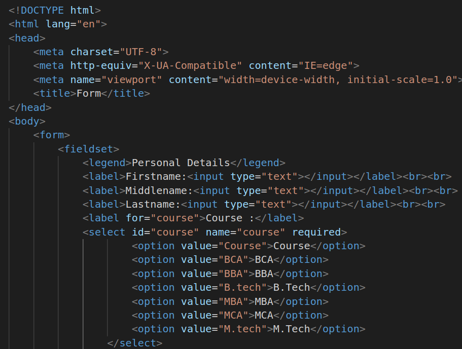
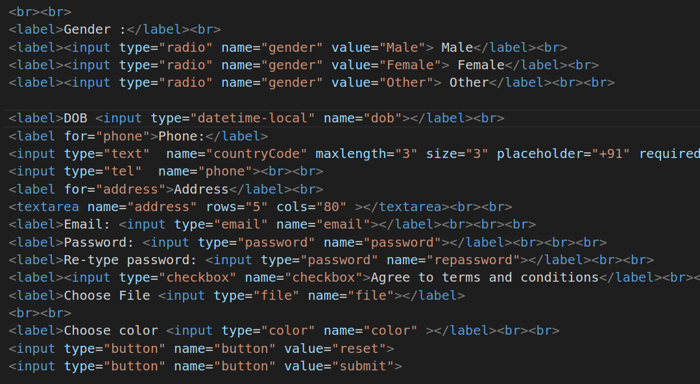

# Form
1.
##### Explanation
* form tag is used to create a form that contains input elements
* fieldset tag is used to to draw a box around other form elements and group the related data.
* legend tag is used to define the title for child contenets.
* label it defines label for form elements.
* input it is used to get input data from the form in various types such as text, password, email, etc by changing its type.
* select it is used to create a drop-down list.
* option it is used to define options in a drop-down list

2.
##### Explanation
* Radio buttons allow the user to select one option from a set.
* datetime-local it will gives the value includes the year, month, day, and time.
* textarea it is used to get input long text content
* email tag is used for email address
* tel tag is used for phone number
* password is input type it used for password
* button is a clickable button to reset and submit opertations.
* br is used to line break
* text is input type it provides text box to enter some content linke name email address.